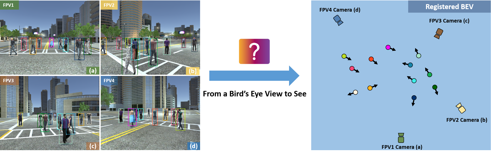
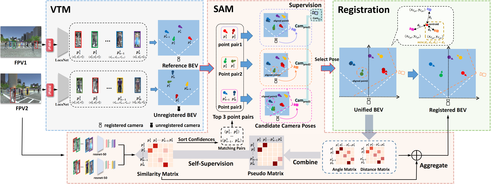

# From a Bird's Eye View to See: Joint Camera and Subject Registration without the Camera Calibration (CVPR 2024)

## Abstract
We tackle a new problem of multi-view camera and subject registration in the bird's eye view (BEV) without pre-given camera calibration, which promotes the multi-view subject registration problem to a new calibration-free stage. This greatly alleviates the limitation in many practical applications.
	However, this is a very challenging problem since its only input is several RGB images from different first-person views (FPVs) for a multi-person scene, without the BEV image and the calibration of the FPVs, while the output is a unified plane aggregated from all views with the positions and orientations of both the subjects and cameras in a BEV.
	For this purpose, we propose an end-to-end framework solving camera and subject registration together by taking advantage of their mutual dependence, whose main idea is as below: 
	i) creating a subject view-transform module (VTM) to project each pedestrian from FPV to a virtual BEV, ii) deriving a multi-view geometry-based spatial alignment module (SAM) to estimate the relative camera pose in a unified BEV, iii) selecting and refining the subject and camera registration results within the unified BEV.
	We collect a new large-scale synthetic dataset with rich annotations for training and evaluation. Additionally, we also collect a real dataset for cross-domain evaluation. 
	The experimental results show the remarkable effectiveness of our method. 

## BEVSee
<figure>
  
  <figcaption>We tackle a new problem of multi-view camera and subject registration problem without pre-given camera calibration.</figcaption>
</figure>

<figure>
  
  <figcaption>Framework of the proposed method, which can be divided into three parts, i.e., VTM, SAM and Registration.</figcaption>
</figure>


## Installation
1. Install python 3.7.11 by conda
```shell
   conda create -n bevsee python=3.7.11
   conda activate bevsee
```
2. Install pytorch (1.8.1) and torchvision (0.9.1)
```shell
   pip install torch==1.8.1+cu111 torchvision==0.9.1+cu111 torchaudio==0.8.1 -f https://download.pytorch.org/whl/torch_stable.html
```
3. Install other packages, there may be package conflicts, which can be ignored.
```shell
  pip install openpifpaf==0.12.12
  pip install -r requirements.txt
```

## Dataset and Models

Our folder structure follows

```
test_2view.py # inference code for CSRD-II
test_5view.py # inference code for CSRD-V
test_real.py # inference code for CSRD-R
train.py # main file of train code
train_net.py # core processing code
├── config
├── dataset 
├── models # models of the BEVSee
    ├── csrd2.pth # loconet and reid network checkpoints for CSRD-II
    ├── csrd5.pth # loconet and reid network checkpoints for CSRD-V
    ├── csrdr.pth # loconet and reid network checkpoints for CSRD-R
    ├── csrdr_reid.pth # loconet and reid network checkpoints for CSRD-R ReID
    ├── pretrained_loconet.pth # loconet and reid network checkpoints for CSRD-R ReID
    ├── reid_checkpoint.pth.tar # pretrained ReID model from Market Dataset
    ├── sector_cache_torch_45_thread.pth # patterns for drawing figures in the code
├── nets # network of the BEVSee
├── reid # network of the BEVSee
├── utils
├── data
    ├── CSRD
        ├── virtual # CSRD-II and CSRD-V
            ├── log
            ├── annotation
                ├── person1.txt # 3d gt of subjects
                ├── ...
                ├── person20.txt
                ├── camera1.txt # 3d gt of cameras
                ├── ...
                ├── camera5.txt
                ├── init_inf.txt # Starting from the third line, each line represents the number of objects in a frame
                ├── fp.pth # f_pid_dict[f"{frame_id}_{p_id}"] = [x, y, r]
                ├── fps.pth # f_pids_dict[int(frame_id)][int(p_id)] = [x, y, r]
                ├── fv.pth # fv_dict[f"{frame}_{view_id}"].append([pid, bbox])
                ├── fvp.pth # fvp_dict[f"{frame}_{view_id}_{pid}"] = bbox
                ├── fvskwh.pth # fv_sk_wh[f"{frame_id}_{view_id}"] = [keypoints([17 * 3], from pifpaf), wh]
                ├── fv_sk_box.pth # fv_sk_box[f"{frame_id}_{view_id}"] = [keypoints, boxes]
                ├── f_top_bbox_pid.pth # f_top_bbox_id_dict[frame].append([top_bbox, pid])
            ├── top_bbox
            ├── hor1_bbox # subject mask images
            ├── ...
            ├── hor5_bbox
            ├── original_img_backup # images of the dataset
                ├── combine # visualization
                ├── top_video 
                ├── hor1_video 
                ├── hor2_video
                ├── hor3_video
                ├── hor4_video
                ├── hor5_video
        ├── real # CSRD-R
            ├── Images
                ├── V2_G1
                    ├── log
                    ├── h1 # images of the dataset
                    ├── h2
                    ├── t
                    ├── json
                        ├── h1
                            ├── out_V2_G1_h1_0076.jpg.monoloco.json # json file contains skeleton and detection boxes from openpifpaf by using the code from monoloco
                            ├── ...
                        ├── h2
                ├── V2_G3
                ├── ...
                ├── V4_G1
                ├── V4_G2
            ├── Gt_txt
                ├── V2_G1_h1.txt # gt of the subjects in the view
                ├── ...
        
   
```


## Getting Started

### Prepare Dataset and Models

1. Prepare the dataset [CSRD (dowload code: Sfjs)](https://pan.quark.cn/s/6182f6bce0ef) and place it to `./data` as the project structure mentioned above.
2. Prepare the models from [Model Zoo (download code: Jk9K)](https://pan.quark.cn/s/f06702cb5925) and place it to `./models` as the project structure mentioned above.

### Inference
1. Test the result of CSRD-II by `python test_2view.py`.
2. Test the result of CSRD-V by `python test_5view.py`.
3. Test the result of CSRD-R by `python test_real.py`.

### Train
```shell
    python train.py
```

### Visualization
Complete the following settings, run the inference code, and you will get visualization results similar to those in the paper.
```python
    cfg.draw_fig = True
    cfg.test_draw_fig_num = 20 # frame nums to visualize per epoch
    cfg.is_colorful = True
```


## Cite BEVSee

```
@inproceedings{qian2024bird,
  title={From a Bird's Eye View to See: Joint Camera and Subject Registration without the Camera Calibration},
  author={Qian, Zekun and Han, Ruize and Feng, Wei and Wang, Feifan and Wang, Song},
  booktitle={Proceedings of the IEEE/CVF Conference on Computer Vision and Pattern Recognition},
  pages={},
  year={2024}
}
```